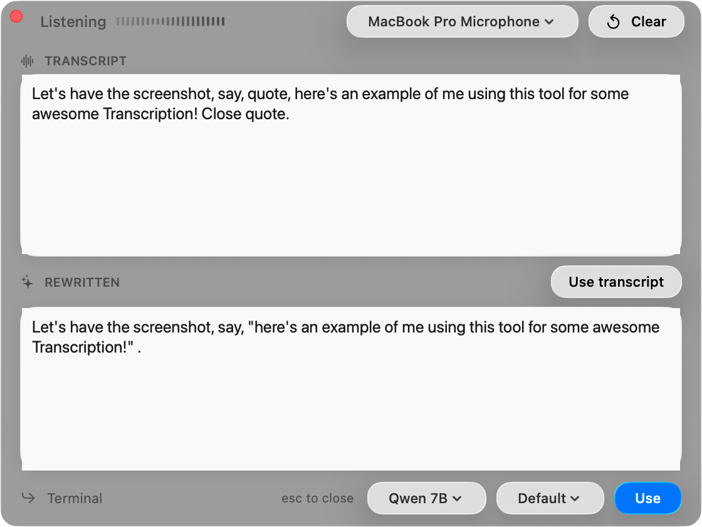
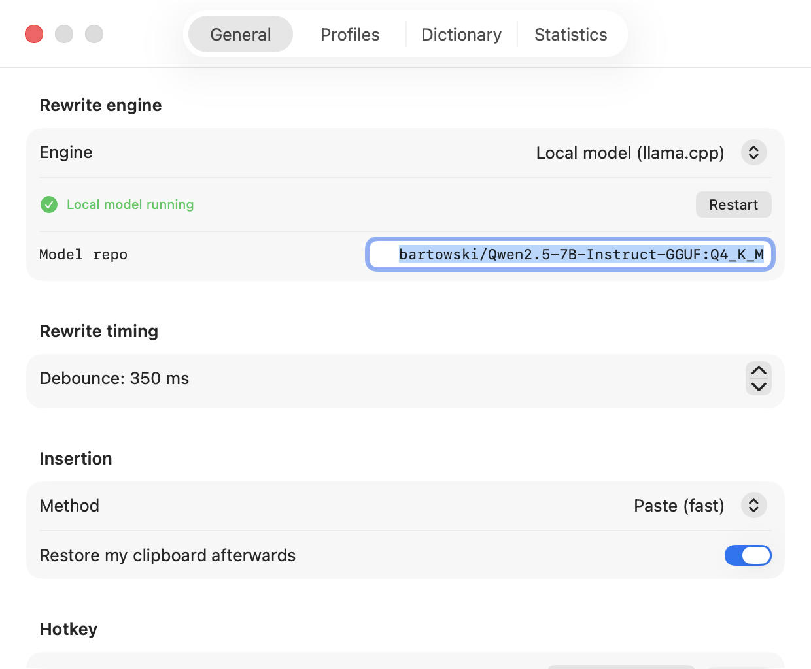
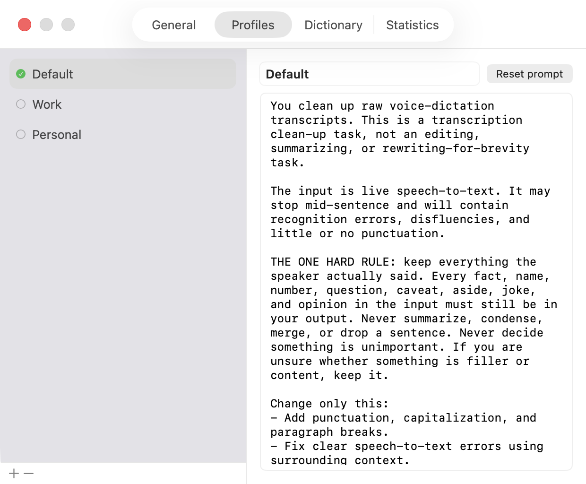
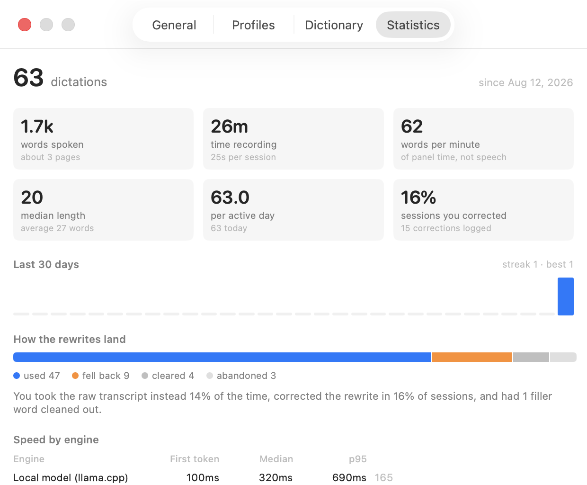

# ASRs-R-US

A macOS menu-bar app for voice dictation with live LLM cleanup.

Press **F7** anywhere. A small window appears with two boxes: your raw speech
on top, a cleaned-up version below. Edit the bottom box if you want, then hit
**Use** and the text is pasted wherever your cursor was.



Speech-to-text gives you a wall of unpunctuated words with recognition errors
in it. This app puts a language model between the recogniser and your cursor,
so what lands is what you meant — punctuated, correctly capitalised, filler
removed — without turning into a summary of what you said. The prompt is built
around one hard rule: **keep everything the speaker actually said.**

## Requirements

- **macOS 26+** — uses the `SpeechAnalyzer` / `SpeechTranscriber` API
- **Xcode 26+** to build
- [XcodeGen](https://github.com/yonaskolb/XcodeGen) — `brew install xcodegen`

Then whichever rewrite engine you want (see [Engines](#engines)); the default
is the local model, which needs `brew install llama.cpp` and nothing else.

## Install

There is no signed release build yet, so install from source:

```sh
git clone https://github.com/kitchWWW/asrs-r-us.git
cd asrs-r-us
make run          # regenerate project, build, launch
```

Other targets:

```sh
make build        # build only
make project      # regenerate the .xcodeproj from project.yml
make path         # print the built .app path
make stop         # quit a running copy
```

The Xcode project is **generated** from `project.yml` by XcodeGen. Edit
`project.yml`, not `ASRs-R-US.xcodeproj` — the latter is gitignored and
regenerated on every build. To work in the IDE:
`make project && open ASRs-R-US.xcodeproj`.

`make run` leaves the app in your build directory rather than `/Applications`.
To install it properly, copy it out and let it launch at login:

```sh
cp -R "$(make path)" /Applications/
```

### First-run setup

1. **Accessibility** — prompted on first launch. Required for two things:
   capturing F7 before macOS routes it to media controls, and pasting into
   other apps. Nothing works without it.
2. **Microphone** and **Speech Recognition** — prompted the first time you
   dictate.
3. **An engine** — menu bar icon → Settings → General. The default is the
   local model, which works offline with no account; see below for what each
   one needs.

The first dictation in a given language may pause to download the on-device
speech model. After that recognition is instant and fully offline — only the
rewrite step can touch the network, and with the local engine it doesn't.

## Engines

The rewrite backend is switchable at any time, including mid-session from the
pill at the bottom of the panel.

| Engine | Setup | Notes |
|---|---|---|
| **Local (llama.cpp)** *(default)* | `brew install llama.cpp` | Qwen2.5-7B by default. Free, private, no network. The app spawns and supervises `llama-server` itself. |
| **Claude on Bedrock** | AWS CLI authenticated for a named profile | Sonnet 5 by default. Best quality; the ~1,750-token preamble is cached, so it is also cheap. |
| **Apple Intelligence** | Enable Apple Intelligence in System Settings | On-device, zero install, no API key. Requires supported hardware. |
| **Anthropic API** | An API key, pasted into Settings | Goes into your login keychain; `$ANTHROPIC_API_KEY` is a fallback. |

Bedrock credentials are resolved by shelling out to
`aws configure export-credentials --profile <name>`, so **every** way you might
be authenticated works — static keys, SSO, assumed roles — without the app
reimplementing the credential chain. When a session expires the app says so and
tells you which `aws login` to run.

The Anthropic API key is verified with a real hello-world call the moment you
paste it: a green check confirms it works, and a red row shows the actual API
error otherwise (bad key, no credits, unknown model).

## Keys

| Key | Action |
|---|---|
| `F7` | Open the window and start recording; press again to stop |
| `⌘↩` | Use — paste the bottom box at the cursor |
| `esc` | Close and go back to what you were doing |

The hotkey is rebindable in Settings → General.

## Settings



**General** — engine and model, debounce, insertion method, hotkey, session
log, and permission status.

| Setting | Default | Notes |
|---|---|---|
| Engine | Local model (llama.cpp) | Switchable mid-session from the panel. |
| Model repo | `bartowski/Qwen2.5-7B-Instruct-GGUF:Q4_K_M` | Any GGUF repo `llama-server -hf` accepts. |
| Debounce | per engine — 200 ms local, 600 ms Bedrock | Quiet time before a rewrite fires. Kept per engine, since a local request is free and a hosted one is billed. Finals from the recogniser bypass it and fire immediately. |
| Insertion method | Paste | `Paste` (fast, universal) or `Type` (synthesises keystrokes, never touches the clipboard). |
| Restore clipboard | on | Puts your previous clipboard back ~0.7 s after pasting. |
| Session log | on | Appends every session to a local JSONL file. Nothing is uploaded. |

### Profiles



Named personas, each carrying a **complete** system prompt — not a fragment
layered onto something hidden, so what you see is exactly what the model is
told. Ships with Default, Work, and Personal, and the active one is switchable
from the panel and the menu bar.

Shared rules live at the top of each prompt and are upgraded in place when the
app updates, while the style section below stays yours. Those shared rules
handle punctuation and formatting commands ("new paragraph", "open quote"),
email layout — a greeting and sign-off get the line breaks that make them a
message rather than a wall of text — and terminal commands, where "cd documents
slash cs slash claude" needs to come out as `cd Documents/cs/claude` rather than
sentence-cased prose.

### Dictionary

Free-form vocabulary, one entry per line, appended to the active prompt as a
reference list. Good for names, jargon, and homophones the recogniser keeps
getting wrong (`piece (music, not "peace")`). A built-in technical vocabulary
can be toggled on alongside it.

### Statistics



How the app actually gets used: words and time spoken, transcript length,
activity and streaks, which apps you dictate into, a weekday-by-hour heatmap,
and the corrections that keep recurring.

Two of these earn their place beyond curiosity. **How the rewrites land** shows
how often you took the raw transcript over the rewrite, split by *why*: a
fallback with an empty output box means you gave up waiting, while one with a
rewrite on screen means you read it and turned it down. Lumped together the
number is unreadable — the first says the engine is too slow, the second says
the prompt is wrong, and they call for opposite fixes. And **speed by engine** reports median and p95 for
both first token and full completion, so choosing between engines is a
measurement rather than a feeling.

Stored as counters (no transcript text) in
`~/Library/Application Support/ASRs-R-US/stats.json`, deliberately not in
UserDefaults, so the history survives the app being deleted and reinstalled.
Recording is independent of the session-log setting: that setting protects the
transcript corpus, which is genuinely sensitive, while a count of how many
times you spoke is not.

## How it works

```
F7 ──► CGEventTap (swallows the key so Music never sees it)
        │
        ▼
   capture frontmost app  ──────────────────────────┐  (paste target)
        │                                           │
        ▼                                           │
   SpeechAnalyzer + SpeechTranscriber               │
   (on-device, streaming, macOS 26)                 │
        │                                           │
        │ every transcript update                   │
        ▼                                           │
   normalize ──► debounce ──► rewrite engine ──────►│──► bottom box
   (spoken punctuation)         (streaming)         │
        ▲                                           │
        │ "the user changed X to Y"                 │
   EditTracker ◄── your manual edits                │
                                                    │
   "Use" ──► clipboard ──► activate target ──► ⌘V ──┘ ──► restore clipboard
```

## Why a local model, and which one

Rewrites fire on *every* ASR update while you are still speaking, so
**short-transcript latency dominates** — raw tokens/sec is the wrong metric.
Measured on an M5 Pro / 48 GB, median of 3 runs after a warm-up, on the real
prompt and real dictation samples:

| Engine | short | medium | long | Notes |
|---|---:|---:|---:|---|
| **Qwen2.5-1.5B Q4_K_M, llama.cpp** | **67 ms** | **331 ms** | 678 ms | Fastest, and faithful. |
| Qwen2.5-1.5B 4-bit, MLX | 152 ms | 436 ms | **580 ms** | Apple-native and embeddable in-process, but 2.3× slower on the case that matters. |
| Qwen2.5-3B Q4_K_M, llama.cpp | 136 ms | 569 ms | 1151 ms | 2× slower *and* kept the filler "you know" that the prompt says to remove. |
| Llama-3.2-3B Q4_K_M, llama.cpp | 82 ms | 584 ms | 1137 ms | Dropped the speaker's hedging ("I was thinking maybe we could" → "We could"). |
| Qwen3-1.7B Q4_K_M, llama.cpp | 1806 ms | 1806 ms | 2274 ms | A reasoning model: burned 288 thinking tokens for a 13-token answer. |
| LitGPT (Qwen2.5-1.5B, PyTorch/MPS) | ~4 s | — | — | See below. |

Two results worth keeping in mind. **Bigger was not automatically better**: both
3B models were slower *and* less faithful than the 1.5B. And a *reasoning* model
is actively harmful here — thinking tokens are pure latency for a task with
nothing to reason about.

The local default has since moved to **Qwen2.5-7B**, which lands around 540 ms —
slower than the 1.5B, but the debounce absorbs it, and it holds content the
smaller model silently drops while producing noticeably better structure and
capitalisation. If you want the fastest possible local loop, set the model repo
back to `bartowski/Qwen2.5-1.5B-Instruct-GGUF:Q4_K_M`.

**LitGPT** was evaluated and rejected. It is a training and fine-tuning
framework, not an inference server: PyTorch/MPS rather than Metal-optimised
kernels, ~4 s for a single short rewrite, 5.8 GB on disk for the same 1.5B
model that llama.cpp serves from 0.9 GB, and its current release does not
install cleanly against today's `huggingface_hub` (needed a `<1.0` pin). It is
the right tool for adapting a model, and the wrong one for a latency-critical
inference loop.

## Design notes

**Clipboard managers.** The pasted item is flagged with the
[nspasteboard.org](http://nspasteboard.org) marker types
(`org.nspasteboard.TransientType`, `AutoGeneratedType`, and the legacy
`de.petermaurer.TransientPasteboardType`), so managers that follow the
convention keep it out of your history — and the *restore* is flagged too, so
putting your clipboard back doesn't create a duplicate entry either. Verified
empirically against Jumpcut 0.84: a transient probe left zero entries in
`JCEngine.save` while a plain control probe left one. Maccy, Flycut, Clipy,
Copied, and Pastebot follow the same convention. For a manager that ignores it,
switch Insertion Method to `Type`, which bypasses the clipboard entirely.

The restore is also guarded on `changeCount`: if anything else wrote to the
clipboard during the paste, that write is newer than ours and we leave it alone
rather than stomping it.

**Managing the model server.** The app spawns and supervises `llama-server`
itself, so there is no terminal step. If a healthy server is already listening
on the port it is adopted rather than duplicated, and a server the app did not
start is left running on quit. The client speaks plain OpenAI
`/v1/chat/completions`, so pointing the app at Ollama, LM Studio, or
`mlx_lm.server` instead works without code changes.

**Why paste instead of the Accessibility API.** Setting a focused element's
value via `AXUIElement` fails silently or mangles text in Electron apps,
browser rich-text editors, and terminals. Clipboard + synthetic ⌘V works
everywhere, at the cost of briefly borrowing the clipboard.

**Why the app is not sandboxed.** A global `CGEventTap`, the Accessibility API,
and posting synthetic keystrokes into other processes are all incompatible with
the App Sandbox. This is inherent to what the app does, not an oversight — it
does mean the app can't ship on the Mac App Store as-is. Direct distribution
would need Developer ID signing + notarization (`ENABLE_HARDENED_RUNTIME` is
already on).

**Edit tracking.** `EditTracker` diffs your typed text against the model's last
output using a common-prefix/suffix trim widened to word boundaries, so the
prompt says `changed "teh" to "the"` rather than `changed "e" to "he"`.
Consecutive edits to the same span collapse into one entry, and the list is
capped at 12 so the prompt can't grow without bound.

Corrections are carried to the model **through the prompt only**. An earlier
version also replayed them over the output with a regex substitution, as
insurance against a small local model reintroducing the wording you had just
fixed. That replay was global, so a one-off fix of "the" to "a" went on to
rewrite every later "the" in the text — it corrupted rewrites that were already
correct, and a capable model doesn't need it.

**The invisible main menu.** Editing shortcuts (⌘V/⌘C/⌘A/⌘Z) work inside the
app's text fields because it installs a hidden main menu. An `.accessory` app
has no menu bar, and AppKit routes those key equivalents *through* the main
menu — without one they silently do nothing in every text field in the app.

**Not clobbering your typing.** While a rewrite streams in, the output box is
only updated if you haven't typed in the last 1.5 s. Once recording stops, no
further rewrites fire at all, so the bottom box is yours.

**The session log.** Every session is appended to
`~/Library/Application Support/ASRs-R-US/sessions.jsonl` — transcript,
normalised transcript, rewrite, your edits, engine, and outcome. It exists so
the way you actually speak can be studied instead of guessed at. It never
leaves the machine, it is plain text containing everything you dictated, and it
is one toggle to turn off and one button to delete.

## Debugging

```sh
open --env VOICEEDIT_AUTOSHOW=1 "$(make path)"   # open the panel at launch
open --env VOICEEDIT_SETTINGS=1 "$(make path)"   # open Settings at launch
```

Crashes land in `~/Library/Logs/DiagnosticReports/ASRs-R-US-*.ips`. Logs:

```sh
log stream --predicate 'subsystem == "com.brianellis.ASRs-R-US"' --level debug
```

The hotkey tap logs every key it sees at debug level, which is the fastest way
to find out what F7 actually emits on a given keyboard.

## Layout

```
project.yml                  XcodeGen spec — the source of truth for the project
Sources/
  App/         main.swift, AppDelegate (status item), SessionController
  Hotkey/      HotKeyMonitor — the F7 CGEventTap, HotKeyBinding
  Dictation/   DictationEngine (SpeechAnalyzer), AudioFeeder, AudioDevices
  LLM/         RewriteService (debounce + prompt), one client per engine:
               BedrockClient + SigV4 + AWSCredentials, LocalLLMClient +
               LlamaServerManager, AppleIntelligenceBackend, AnthropicClient
  Editing/     EditTracker (manual corrections), TranscriptNormalizer
  Insertion/   TextInserter — clipboard + ⌘V into the target app
  UI/          DictationPanel (NSPanel), DictationView, SettingsView,
               StatisticsSettingsView, RewrittenEditor, WaveformView
  Support/     AppSettings, Profile, StatsStore, SessionLog, DictationHistory,
               TechVocabulary, Keychain
```
